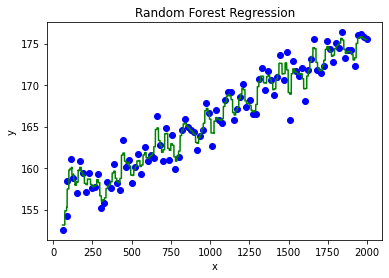

```python
import numpy as np
import matplotlib.pyplot as plt
import pandas as pd
import warnings  
warnings.filterwarnings('ignore')
```


```python
data=pd.read_csv("Random-Forest-Regression-Data.csv")
```


```python
data.head
```


    <bound method NDFrame.head of               x           y
    0     59.000000  152.553428
    1     88.696970  158.420441
    2     87.443939  154.189316
    3    110.090909  161.136969
    4    126.787879  158.819572
    ..          ...         ...
    95  1921.212121  172.285091
    96  1940.909091  176.001331
    97  1960.606061  176.128171
    98  1980.303030  175.813257
    99  2000.000000  175.530826
    
    [100 rows x 2 columns]>


```python
data.columns

```


    Index(['x', 'y'], dtype='object')


```python
x=data.x.values.reshape(-1,1)
```


```python
y=data.y.values.reshape(-1,1)
```


```python
from sklearn.ensemble import RandomForestRegressor
```


```python
regressor=RandomForestRegressor(n_estimators=100,random_state=0)
regressor.fit(x,y)
```


    RandomForestRegressor(random_state=0)


```python
y_pred=regressor.predict(np.array([6.5]).reshape(1,1))
```


```python
x_grid=np.arange(min(x),max(x),0.01)
```


```python
x_grid=x_grid.reshape((len(x_grid),1))
```


```python
plt.scatter(x,y,color='blue')
plt.plot(x_grid, regressor.predict(x_grid),color = 'green') 
plt.title('Random Forest Regression')
plt.xlabel('x')
plt.ylabel('y')
plt.show()
```





```python

```
